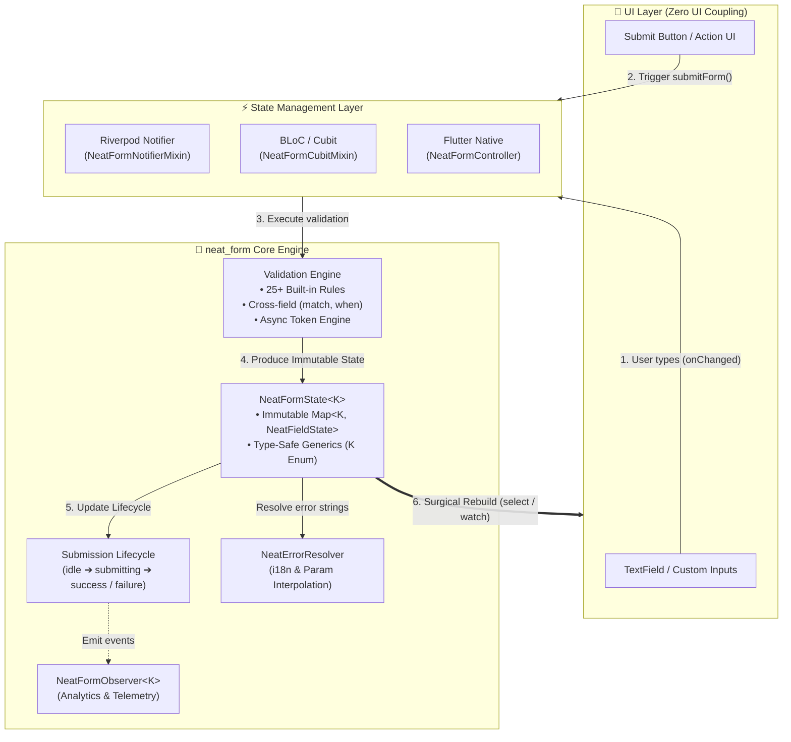
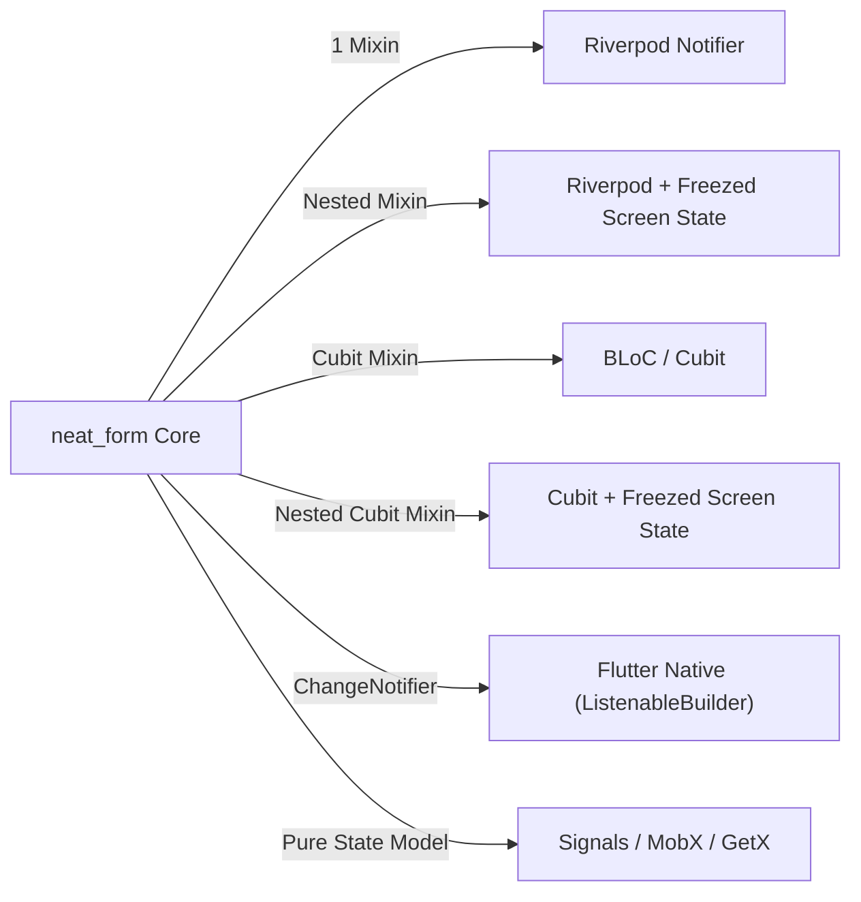
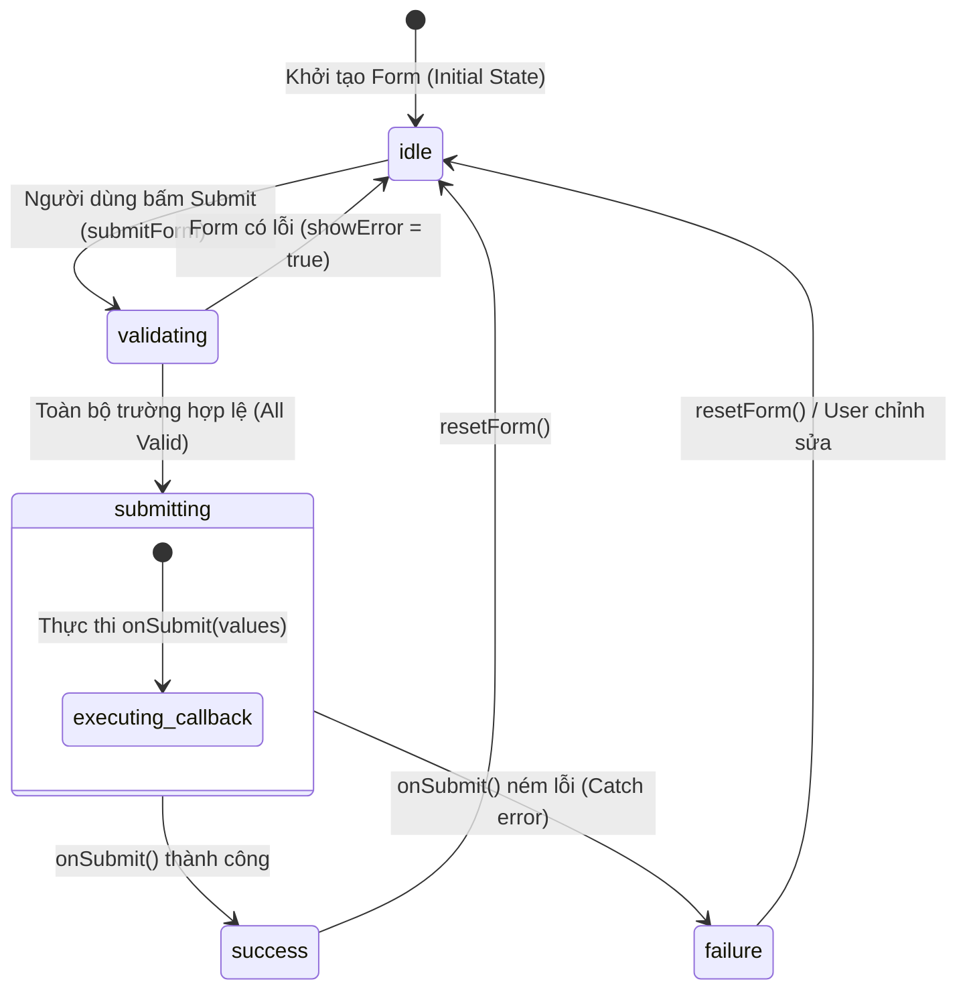
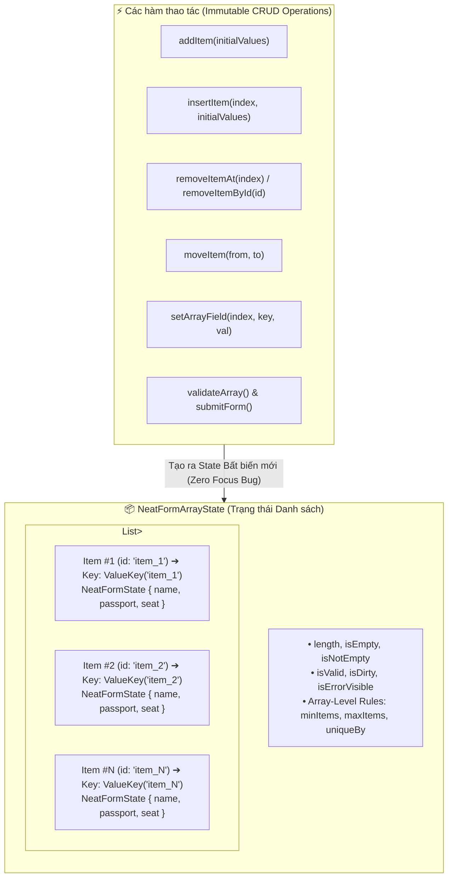
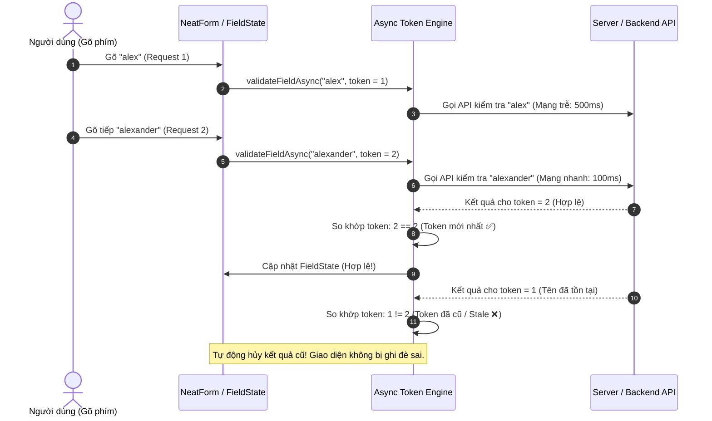

# neat_form 📋

Một thư viện quản lý trạng thái form và validation gọn nhẹ, mạnh mẽ, type-safe (100% `Object?`) dành cho **Flutter & Dart**.

[](https://pub.dev/packages/neat_form)
[](https://opensource.org/licenses/MIT)
[](https://github.com/datnguyennt/neat_form)
[](https://pub.dev)

> **[Tiếng Việt](#tiếng-việt) | [English](README_EN.md)**

---

<a name="tiếng-việt"></a>
## 🇻🇳 Giới thiệu

**`neat_form`** được thiết kế theo tư duy **Headless (Zero UI Coupling)**, **State-driven**, và **Immutable**. Package giải phóng bạn khỏi sự phức tạp của form validation trong Flutter, hoạt động độc lập hoặc tích hợp liền mạch với mọi thư viện State Management (Riverpod, BLoC, Cubit, Signals, v.v.).

---

### 🌐 Nền tảng hỗ trợ (Supported Platforms)

`neat_form` hoạt động 100% mượt mà trên tất cả các nền tảng được Flutter hỗ trợ:

| Platform | Hỗ trợ | Ghi chú |
| :--- | :---: | :--- |
| **Android** | ✅ | Hỗ trợ mọi phiên bản Android |
| **iOS** | ✅ | Hỗ trợ mọi phiên bản iOS |
| **Web** | ✅ | Tương thích CanvasKit & HTML renderer |
| **macOS** | ✅ | Desktop App |
| **Windows** | ✅ | Desktop App |
| **Linux** | ✅ | Desktop App |

---

### ⚙️ Yêu cầu hệ thống (System Requirements)

- **Flutter SDK:** `>= 3.0.0`
- **Dart SDK:** `>= 3.0.0 < 4.0.0`
- **Zero Third-party Dependencies:** Không phụ thuộc bất kỳ thư viện bên ngoài nào (chỉ dùng Flutter SDK & `meta`), đảm bảo **100% không bao giờ gặp lỗi xung đột phiên bản (No Version Conflicts)**.

---

### ✨ Tính năng nổi bật

- 🚀 **Zero UI Coupling (Headless Form):** Logic form thuần túy, bạn toàn quyền thiết kế giao diện UI theo Design System riêng mà không bị gò bó.
- 🎯 **Native Flutter Integration:** `NeatFormController` kế thừa `ChangeNotifier` / `Listenable`, dùng trực tiếp với `ListenableBuilder` hoặc `AnimatedBuilder` mà không cần cài thêm thư viện ngoài.
- 🔒 **Type-Safe Tuyệt đối (100% `Object?` - No `dynamic`):** Bắt lỗi kiểu tĩnh lúc compile-time, an toàn dữ liệu tuyệt đối.
- 🌐 **Localization Độc lập:** Lỗi trả về `code` và `params`. `NeatErrorResolver` tự động thay thế biến template như `{minLength}`, `{maxValue}` vào câu thông báo.
- ⏱️ **Chống Race Condition trong Async Validation:** Quản lý token tự động hủy kết quả cũ nếu dữ liệu thay đổi trước khi request mạng hoàn tất.
- 🔄 **Submission Lifecycle:** Tự động quản lý 4 trạng thái nộp form (`idle`, `submitting`, `success`, `failure`).
- 🛠️ **25+ Built-in Validators:** Đầy đủ từ chuỗi, số học, regex, thẻ tín dụng Luhn, ngày tháng, consent boolean cho tới mảng/danh sách động.
- 🎨 **Built-in Input Formatters & Masking:** Định dạng tiền tệ thời gian thực, thẻ ngân hàng, mặt nạ chuỗi, ngày tháng, casing thuần Flutter SDK (0 external dependencies).

---

### 🏗️ Sơ đồ Kiến trúc & Luồng hoạt động (Architecture & Flow)

#### 1. Luồng Dữ liệu & Kiến trúc Tổng thể (Headless Pattern)

`neat_form` phân tách rành mạch 3 tầng: **UI Layer (Headless Widgets)** ➔ **State Management Layer (Mixins & Controllers)** ➔ **Core Logic Engine**.

<p align="center">
  
</p>

<details>
<summary>👁️ Xem mã nguồn Mermaid Diagram</summary>


</details>

#### 2. Tương thích Đa Nền tảng State Management

<p align="center">
  
</p>

<details>
<summary>👁️ Xem mã nguồn Mermaid Diagram</summary>


</details>

---

### 📦 Cài đặt

Thêm `neat_form` vào file `pubspec.yaml`:

```yaml
dependencies:
  neat_form: ^1.1.1
```

Hoặc chạy lệnh:
```bash
flutter pub add neat_form
```

---

### 🚀 Hướng dẫn sử dụng nhanh

#### ⚡ Cách 1: Tích hợp hoàn hảo với Riverpod (Notifier & Freezed)

##### A. Standalone Form State (Dạng Form Đơn - Siêu Gọn Chỉ 1 Mixin)
Sử dụng `NeatFormNotifierMixin<K>` — **chỉ cần 1 mixin duy nhất**, không cần viết bất kỳ hàm boilerplate nào:

```dart
import 'package:flutter/material.dart';
import 'package:flutter_riverpod/flutter_riverpod.dart';
import 'package:neat_form/neat_form.dart';

enum LoginFormKey { email, password }

// 1. Notifier siêu sạch: Đúng 1 mixin, KHÔNG boilerplate!
class LoginNotifier extends Notifier<NeatFormState<LoginFormKey>>
    with NeatFormNotifierMixin<LoginFormKey> {
  @override
  NeatFormState<LoginFormKey> build() => NeatFormState.fromValues({
        LoginFormKey.email: '',
        LoginFormKey.password: '',
      });

  @override
  Map<LoginFormKey, NeatValidator<Object?>> get validators => {
        LoginFormKey.email: NeatValidators.combine([
          NeatValidators.required(message: 'Email không được để trống'),
          NeatValidators.email(message: 'Email không hợp lệ'),
        ]),
        LoginFormKey.password: NeatValidators.combine([
          NeatValidators.required(message: 'Mật khẩu không được để trống'),
          NeatValidators.minLength(8, message: 'Tối thiểu 8 ký tự'),
        ]),
      };
}

final loginNotifierProvider =
    NotifierProvider<LoginNotifier, NeatFormState<LoginFormKey>>(LoginNotifier.new);

// 2. UI với Surgical Rebuild (Chỉ rebuild đúng ô input bị thay đổi nhờ select)
class EmailInput extends ConsumerWidget {
  const EmailInput({super.key});

  @override
  Widget build(BuildContext context, WidgetRef ref) {
    final email = ref.watch(
      loginNotifierProvider.select((s) => s.field<String>(LoginFormKey.email)),
    );

    return TextField(
      onChanged: (val) => ref.read(loginNotifierProvider.notifier).setField(LoginFormKey.email, val),
      decoration: InputDecoration(
        labelText: 'Email',
        errorText: email.errorMessage, // ✨ Tự động hiển thị message lỗi nếu có
      ),
    );
  }
}
```

##### B. Nested / Freezed Screen State (Khi Form nằm bên trong State màn hình)
Nếu bạn dùng **Freezed** để quản lý State màn hình (`LoginScreenState` chứa form và các biến khác), dùng `NeatNestedFormNotifierMixin<S, K>`:

```dart
// 1. Khai báo Freezed State
@freezed
class LoginScreenState with _$LoginScreenState {
  const factory LoginScreenState({
    @Default(false) bool isSubmitting,
    @Default(false) bool rememberMe,
    String? serverError,
    required NeatFormState<LoginFormKey> form,
  }) = _LoginScreenState;
}

// 2. Notifier lồng Freezed State mượt mà
class LoginScreenNotifier extends Notifier<LoginScreenState>
    with NeatNestedFormNotifierMixin<LoginScreenState, LoginFormKey> {
  @override
  LoginScreenState build() => LoginScreenState(
        form: NeatFormState.fromValues({
          LoginFormKey.email: '',
          LoginFormKey.password: '',
        }),
      );

  @override
  NeatFormState<LoginFormKey> getForm(LoginScreenState state) => state.form;

  @override
  LoginScreenState updateForm(LoginScreenState state, NeatFormState<LoginFormKey> form) =>
      state.copyWith(form: form);

  @override
  Map<LoginFormKey, NeatValidator<Object?>> get validators => { ... };
}
```

---

#### ⚡ Cách 2: Tích hợp với BLoC / Cubit (Hỗ trợ cả Standalone & Freezed)

##### A. Standalone Cubit Form (Tự động kết nối `emit()`)
Sử dụng `NeatFormCubitMixin<K>` — không cần override hàm update hay emit thủ công:

```dart
import 'package:flutter_bloc/flutter_bloc.dart';
import 'package:neat_form/neat_form.dart';

enum ProfileKey { name, age }

class ProfileCubit extends Cubit<NeatFormState<ProfileKey>>
    with NeatFormCubitMixin<ProfileKey> {
  ProfileCubit()
      : super(
          NeatFormState.fromValues({
            ProfileKey.name: '',
            ProfileKey.age: null,
          }),
        );

  @override
  Map<ProfileKey, NeatValidator<Object?>> get validators => {
        ProfileKey.name: NeatValidators.required(message: 'Tên không được để trống'),
        ProfileKey.age: NeatValidators.combine([
          NeatValidators.required(),
          NeatValidators.minValue(18, message: 'Phải từ 18 tuổi trở lên'),
        ]),
      };

  void onNameChanged(String val) => setAndValidateField(ProfileKey.name, val);
  void onAgeChanged(int? val) => setAndValidateField(ProfileKey.age, val);
}
```

##### B. Cubit với Freezed Screen State
Sử dụng `NeatNestedFormCubitMixin<S, K>` cho Cubit khi State là một Freezed class:

```dart
class ProfileCubit extends Cubit<ProfileScreenState>
    with NeatNestedFormCubitMixin<ProfileScreenState, ProfileKey> {
  ProfileCubit() : super(ProfileScreenState(form: NeatFormState.fromValues({ ... })));

  @override
  NeatFormState<ProfileKey> getForm(ProfileScreenState state) => state.form;

  @override
  ProfileScreenState updateForm(ProfileScreenState state, NeatFormState<ProfileKey> form) =>
      state.copyWith(form: form);

  @override
  Map<ProfileKey, NeatValidator<Object?>> get validators => { ... };
}
```

---

#### ⚡ Cách 3: Flutter Native với `ListenableBuilder` (Không cần State Management)

```dart
import 'package:flutter/material.dart';
import 'package:neat_form/neat_form.dart';

enum LoginFormKey { email, password }

class LoginFormPage extends StatefulWidget {
  const LoginFormPage({super.key});

  @override
  State<LoginFormPage> createState() => _LoginFormPageState();
}

class _LoginFormPageState extends State<LoginFormPage> {
  late final NeatFormController<LoginFormKey> _form;

  @override
  void initState() {
    super.initState();
    _form = NeatFormController<LoginFormKey>(
      initialFields: {
        LoginFormKey.email: const NeatFieldState<String>(value: ''),
        LoginFormKey.password: const NeatFieldState<String>(value: ''),
      },
      validators: {
        LoginFormKey.email: NeatValidators.combine([
          NeatValidators.required(message: 'Email không được để trống'),
          NeatValidators.email(message: 'Email không đúng định dạng'),
        ]),
        LoginFormKey.password: NeatValidators.combine([
          NeatValidators.required(message: 'Mật khẩu không được để trống'),
          NeatValidators.minLength(8, message: 'Tối thiểu {minLength} ký tự'),
          NeatValidators.passwordStrength(message: 'Cần ít nhất 1 chữ hoa, 1 số, 1 ký tự đặc biệt'),
        ]),
      },
    );
  }

  @override
  void dispose() {
    _form.dispose();
    super.dispose();
  }

  @override
  Widget build(BuildContext context) {
    return ListenableBuilder(
      listenable: _form,
      builder: (context, _) {
        final emailField = _form.getField<String>(LoginFormKey.email);
        final passwordField = _form.getField<String>(LoginFormKey.password);

        return Column(
          children: [
            TextField(
              onChanged: (val) => _form.setField(LoginFormKey.email, val),
              decoration: InputDecoration(
                labelText: 'Email',
                errorText: emailField.errorMessage,
              ),
            ),
            TextField(
              obscureText: true,
              onChanged: (val) => _form.setField(LoginFormKey.password, val),
              decoration: InputDecoration(
                labelText: 'Mật khẩu',
                errorText: passwordField.errorMessage,
              ),
            ),
            ElevatedButton(
              onPressed: _form.submissionStatus.isSubmitting
                  ? null
                  : () async {
                      await _form.submitForm(
                        onSubmit: (values) async {
                          print('Dữ liệu form hợp lệ: $values');
                        },
                      );
                    },
              child: _form.submissionStatus.isSubmitting
                  ? const CircularProgressIndicator()
                  : const Text('Đăng nhập'),
            ),
          ],
        );
      },
    );
  }
}
```

---

### 🔄 Vòng đời Xử lý Submit Form (Submission Lifecycle)

`neat_form` tích hợp sẵn máy trạng thái (State Machine) 4 bước thông qua `NeatSubmissionStatus`:

<p align="center">
  
</p>

<details>
<summary>👁️ Xem mã nguồn Mermaid Diagram</summary>


</details>

---

### 📋 Bảng tra cứu Built-in Validators (Cheat Sheet)

| Nhóm | Validator | Mô tả |
| :--- | :--- | :--- |
| **Bắt buộc & Chuỗi** | `required()` | Bắt buộc nhập, không được null/rỗng |
| | `notBlank()` | Không được chỉ chứa toàn khoảng trắng |
| | `exactLength(n)` | Độ dài chuỗi chính xác tuyệt đối $n$ ký tự |
| | `minLength(n)` | Độ dài tối thiểu $n$ ký tự |
| | `maxLength(n)` | Độ dài tối đa $n$ ký tự |
| | `lengthRange(min, max)` | Độ dài nằm trong khoảng $[min, max]$ |
| | `startsWith(prefix)` | Bắt đầu bằng tiền tố |
| | `endsWith(suffix)` | Kết thúc bằng hậu tố |
| | `contains(sub)` / `notContains(sub)` | Chứa hoặc không chứa chuỗi con |
| | `latinOnly()` | Chỉ chứa chữ cái tiếng Anh không dấu |
| | `noEmoji()` | Chặn icon/emoji |
| **Định dạng & Bảo mật** | `email()` | Kiểm tra định dạng email chuẩn |
| | `phone()` | Số điện thoại (8-15 số, hỗ trợ `+`) |
| | `passwordStrength()` | Yêu cầu chữ hoa, thường, số, ký tự đặc biệt |
| | `creditCard()` | Kiểm tra số thẻ tín dụng bằng thuật toán Luhn |
| | `url()` | Địa chỉ website (http, https) |
| | `numeric()` | Chuỗi số nguyên hoặc thập phân |
| | `alphanumericOnly()` | Chỉ gồm chữ cái và chữ số |
| | `noSpecialChars()` | Không chứa ký tự đặc biệt |
| | `noSpaces()` / `noLeadingTrailingSpaces()` | Không có dấu cách / dấu cách ở 2 đầu |
| | `blacklist(words)` | Chặn từ khóa nằm trong danh sách đen |
| | `noHtml()` | Chặn thẻ HTML / script chống XSS |
| **Số học** | `minValue(n)` / `maxValue(n)` | Giá trị số tối thiểu / tối đa |
| | `positive()` / `negative()` | Số dương ($> 0$) hoặc số âm ($< 0$) |
| | `multipleOf(step)` | Bội số chia hết (bước nhảy giá) |
| | `decimalPrecision(maxDec)` | Số lượng chữ số thập phân tối đa |
| **Thời gian & Ngày** | `pastDate()` | Ngày phải ở quá khứ (ngày sinh) |
| | `futureDate()` | Ngày phải ở tương lai (hạn thẻ) |
| | `dateRange(min, max)` | Ngày nằm trong khoảng cho phép |
| **Boolean & Consent**| `mustBeTrue()` | Bắt buộc tick (Điều khoản dịch vụ) |
| | `mustBeFalse()` | Bắt buộc là false |
| **Mảng & Danh sách** | `minItems(n)` / `maxItems(n)` | Số lượng phần tử tối thiểu / tối đa |
| | `uniqueItems()` | Danh sách không có phần tử trùng lặp |
| **Logic & Tổ hợp** | `match(targetGetter)` | Khớp với giá trị trường khác (xác nhận mật khẩu) |
| | `when(condition, validator)` | Validate có điều kiện (`requiredIf`) |
| | `combine([v1, v2, ...])` | Ghép nhiều luật validate lại với nhau |
| | `custom(predicate)` | Tự viết hàm validate tùy biến nhanh |

---

### 🌐 Đa ngôn ngữ (Localization & Error Resolver)

`neat_form` tách biệt hoàn toàn thông điệp hiển thị khỏi logic. Bạn có thể định nghĩa template nội suy tham số:

```dart
final resolver = NeatErrorResolver<BuildContext>();

// Đăng ký bộ dịch theo mã lỗi
resolver.register(
  NeatValidators.codeMinLength,
  (context, params, fieldName) {
    return '$fieldName tối thiểu ${params["minLength"]} ký tự';
  },
);

// Sử dụng tại UI
final errorText = resolver.resolve(context, fieldState.error!, fieldName: 'Mật khẩu');
```

---

### 🎨 Bộ định dạng đầu vào & Masking (`NeatInputFormatters`)

`neat_form` tích hợp sẵn bộ `TextInputFormatter` thuần Flutter (0 external dependencies) giúp tự động format và xử lý con trỏ chuẩn xác:

#### 1. Định dạng Tiền tệ (`currency`)
```dart
final currencyFormatter = NeatInputFormatters.currency(
  thousandSeparator: '.',
  decimalSeparator: ',',
  suffix: ' ₫',
);

TextField(
  keyboardType: TextInputType.number,
  inputFormatters: [currencyFormatter],
  onChanged: (val) {
    // Trích xuất số thực double/int để lưu vào Form State
    final amount = currencyFormatter.getNumericValue(val);
    form.setField(PaymentKey.amount, amount);
  },
);
```

#### 2. Định dạng Thẻ ngân hàng (`creditCard`)
Tự động nhận diện loại thẻ và ngắt cụm 4-4-4-4 (Visa/Mastercard/JCB) hoặc 4-6-5 (American Express):
```dart
TextField(
  keyboardType: TextInputType.number,
  inputFormatters: [NeatInputFormatters.creditCard()],
  onChanged: (val) => form.setField(
    PaymentKey.cardNumber,
    NeatCardFormatter.getCleanCardNumber(val), // '4111222233334444'
  ),
);
```

#### 3. Định dạng Mặt nạ chuỗi (`mask`)
```dart
// Số điện thoại, CCCD hoặc mã định danh
final phoneFormatter = NeatInputFormatters.mask('(###) ###-####');

TextField(
  keyboardType: TextInputType.phone,
  inputFormatters: [phoneFormatter],
  onChanged: (val) => form.setField(
    RegisterKey.phone,
    phoneFormatter.getUnmaskedText(val), // '0901234567'
  ),
);
```

#### 4. Định dạng Ngày tháng (`date`)
```dart
TextField(
  keyboardType: TextInputType.number,
  inputFormatters: [
    NeatInputFormatters.date(format: NeatDateFormat.ddMMyyyy),
  ],
);
```

#### 5. Formatters tiện ích
- `NeatInputFormatters.uppercase()`: Tự động viết hoa (mã giảm giá, biển số xe).
- `NeatInputFormatters.lowercase()`: Tự động viết thường (username, email).
- `NeatInputFormatters.latinOnly()`: Chỉ cho phép ký tự không dấu `[a-zA-Z0-9_]`.
- `NeatInputFormatters.noSpaces()`: Chặn khoảng trắng.

---

### ✈️ Dynamic Form Array (`NeatFormArray`) — Danh sách Form Động

Quản lý danh sách các sub-form thêm / bớt / sắp xếp động (như danh sách hành khách đặt vé máy bay, nhiều địa chỉ nhận hàng, dòng sản phẩm trong hóa đơn) với **Stable Unique ID** chống nhảy focus khi xóa item:

<p align="center">
  
</p>

<details>
<summary>👁️ Xem mã nguồn Mermaid Diagram</summary>


</details>

```dart
// 1. Khai báo Enum trường của từng item
enum PassengerField { fullName, passportNumber, seatType }

// 2. Khởi tạo Controller mảng
final passengerArray = NeatFormArrayController<PassengerField>(
  initialItems: [
    {PassengerField.fullName: 'Nguyen Van A', PassengerField.passportNumber: 'B1234567'},
  ],
  // Template validators áp dụng cho mỗi item
  itemValidators: {
    PassengerField.fullName: NeatValidators.required(message: 'Vui lòng nhập họ tên'),
    PassengerField.passportNumber: NeatValidators.combine([
      NeatValidators.required(message: 'Vui lòng nhập số hộ chiếu'),
      NeatValidators.alphanumericOnly(message: 'Số hộ chiếu chỉ gồm chữ và số'),
    ]),
  },
  // Quy tắc kiểm tra trên toàn bộ danh sách
  arrayValidators: [
    NeatArrayValidators.minItems(1, message: 'Cần ít nhất 1 hành khách'),
    NeatArrayValidators.maxItems(5, message: 'Tối đa 5 hành khách mỗi lượt đặt'),
    NeatArrayValidators.uniqueBy<PassengerField, String>(
      (form) => form.valueOf<String>(PassengerField.passportNumber),
      message: 'Số hộ chiếu không được trùng nhau giữa các hành khách',
    ),
  ],
);

// 3. UI Flutter Declarative (Sử dụng item.id làm ValueKey an toàn 100%)
ListenableBuilder(
  listenable: passengerArray,
  builder: (context, _) {
    return Column(
      children: [
        ...passengerArray.items.asMap().entries.map((entry) {
          final index = entry.key;
          final item = entry.value;
          final form = item.form;

          return Card(
            key: ValueKey(item.id), // ✨ KHÔNG BAO GIỜ bị nhảy focus khi xóa/thêm item!
            child: ListTile(
              title: TextField(
                onChanged: (v) => passengerArray.setArrayField(index, PassengerField.fullName, v),
                decoration: InputDecoration(
                  labelText: 'Họ tên hành khách #${index + 1}',
                  errorText: form.field(PassengerField.fullName).errorMessage,
                ),
              ),
              trailing: IconButton(
                icon: const Icon(Icons.delete),
                onPressed: () => passengerArray.removeItemAt(index),
              ),
            ),
          );
        }),

        ElevatedButton(
          onPressed: () => passengerArray.addItem({PassengerField.fullName: ''}),
          child: const Text('+ Thêm Hành Khách'),
        ),
      ],
    );
  },
);
```

#### Các hàm thao tác với `NeatFormArray`:
- `addItem(initialValues)`: Thêm một sub-form mới vào cuối danh sách.
- `insertItem(index, initialValues)`: Chèn một sub-form vào vị trí `index`.
- `removeItemAt(index)` / `removeItemById(id)`: Xóa sub-form an toàn.
- `moveItem(fromIndex, toIndex)`: Hoán đổi vị trí (dành cho `ReorderableListView`).
- `setArrayField(itemIndex, key, value)`: Cập nhật giá trị trường của item cụ thể.
- `validateArray()`: Validate đồng thời tất cả sub-forms và các ràng buộc toàn mảng (`minItems`, `maxItems`, `uniqueBy`).
- `submitForm(onSubmit: (values) async { ... })`: Submit lấy dữ liệu `List<Map<K, Object?>>`.
- Hỗ trợ đầy đủ mixin Riverpod (`NeatFormArrayNotifierMixin`) & BLoC (`NeatFormArrayCubitMixin`).

---

### 📊 Giám sát sự kiện & Analytics (Form Observer)

`neat_form` cung cấp `NeatFormObserver<K>` để theo dõi toàn bộ vòng đời form, sự kiện thay đổi giá trị, lỗi validation, và trạng thái submit — lý tưởng cho analytics, telemetry và debug logging:

```dart
class AppFormObserver extends NeatFormObserver<LoginFormKey> {
  @override
  void onFieldChanged(LoginFormKey key, Object? value) {
    debugPrint('Field [${key.name}] changed to: $value');
  }

  @override
  void onValidationError(LoginFormKey key, NeatValidationError error) {
    debugPrint('Validation failed on [${key.name}]: ${error.code}');
  }

  @override
  void onSubmissionStatusChanged(NeatSubmissionStatus status) {
    debugPrint('Form submission status: ${status.name}');
  }

  @override
  void onFormSubmitted(Map<LoginFormKey, Object?> values, {required bool isValid}) {
    debugPrint('Form submitted: isValid=$isValid, values=$values');
  }
}
```

---

### ⚡ Kiểm tra bất đồng bộ chống Race-Condition (Async Validation)

Sử dụng `validateFieldAsync` với cơ chế sequence token tự động vô hiệu hóa kết quả của các request cũ nếu người dùng tiếp tục gõ phím:

<p align="center">
  
</p>

<details>
<summary>👁️ Xem mã nguồn Mermaid Diagram</summary>


</details>

```dart
await form.validateFieldAsync<String>(
  SignupFormKey.username,
  (username) async {
    final isTaken = await api.checkUsernameTaken(username);
    if (isTaken) {
      return const NeatValidationError(
        'username_taken',
        message: 'Tên đăng nhập đã tồn tại',
      );
    }
    return null;
  },
);
```

---

### ⚠️ Giới hạn & Câu hỏi thường gặp (Limitations & FAQ)

#### 1. Package có cung cấp sẵn các Widget giao diện (ví dụ `NeatTextField`) không?
> **Không.** `neat_form` tuân thủ nguyên lý **Headless Form**. Thư viện quản lý state và validation thuần túy, giúp bạn tự do 100% sử dụng với `TextField`, `TextFormField`, custom design system, hay bất kỳ thư viện UI nào (shadcn-flutter, flutter_neumorphic, v.v.) mà không bị gò bó style.

#### 2. Làm thế nào để validate Form nhiều bước (Wizard / Multi-step Form)?
> Rất đơn giản! Phương thức `validateForm` cho phép truyền vào danh sách các key của bước hiện tại:
> ```dart
> final isStep1Valid = form.validateForm([StepKey.email, StepKey.phone]);
> ```

#### 3. Asynchronous Validation có bị gián đoạn hay làm chậm giao diện không?
> `neat_form` tích hợp cơ chế **Race Condition Token**. Khi người dùng gõ phím liên tục, các kết quả request cũ sẽ tự động bị hủy bỏ và chỉ kết quả mới nhất được cập nhật. Bạn nên kết hợp thêm `Timer` debounce (như minh họa trong thư mục `example/lib/main.dart`).

---

### 📱 Ứng dụng mẫu (Flutter Showcase App)

Ứng dụng mẫu đa nền tảng (iOS, Android, Web, macOS) nằm trong thư mục `example/`. Bao gồm 4 Tab nghiệp vụ và màn hình **Full Demo Screen (`DynamicCheckoutShowcaseScreen`)** kết hợp:
- **Dynamic Flight Passenger Booking**: Danh sách thêm/bớt hành khách động, chặn trùng lặp số hộ chiếu (`NeatArrayValidators.uniqueBy`).
- **Fintech & Card Formatting**: Auto format thẻ ngân hàng 4-4-4-4, hạn thẻ `MM/YY`, CVV, mã giảm giá.
- **Live State Output**: Hiển thị luồng JSON và trạng thái form thời gian thực.

Chạy ứng dụng mẫu:
```bash
cd example
flutter run -d chrome # hoặc -d ios, -d android, -d macos
```

---

## 📝 Giấy phép (License)

Phát hành dưới giấy phép [MIT License](LICENSE).
