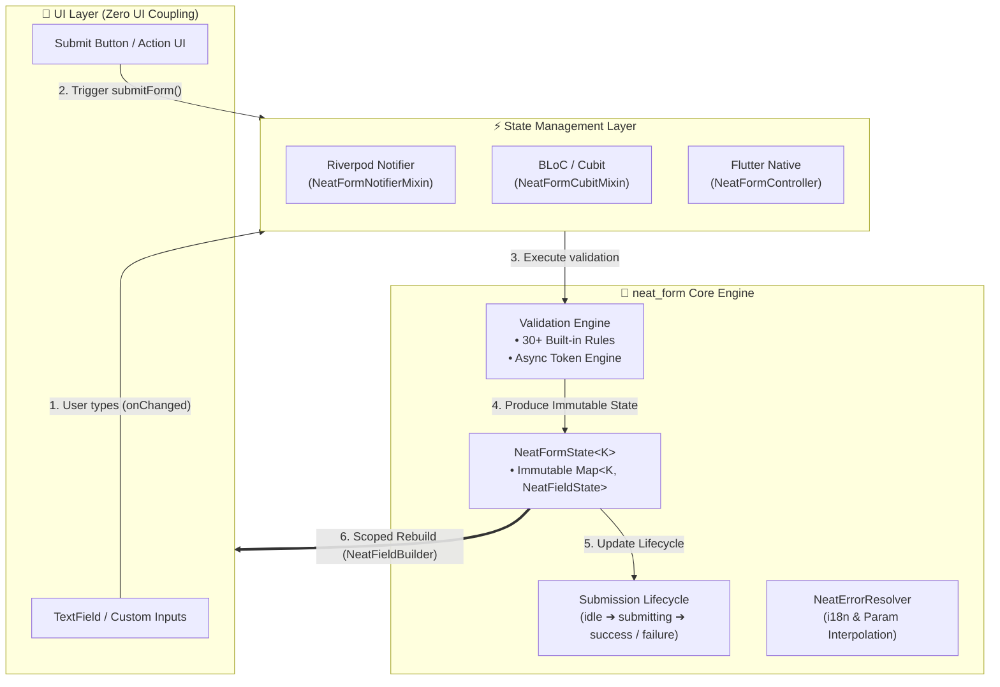

# neat_form 📋

Một thư viện quản lý trạng thái form và validation gọn nhẹ, mạnh mẽ, type-safe (100% `Object?`) dành cho **Flutter & Dart**.

[](https://pub.dev/packages/neat_form)
[](https://opensource.org/licenses/MIT)
[](https://github.com/datnguyennt/neat_form)
[](https://pub.dev)

> **[Tiếng Việt](#tiếng-việt) | [English](README_EN.md)**

---

<a id="tieng-viet"></a>
<a id="muc-luc"></a>
## 📑 Mục Lục
- [1. 🇻🇳 Giới thiệu](#gioi-thieu)
- [2. ✨ Tính năng nổi bật](#tinh-nang-noi-bat)
- [3. 🏗️ Sơ đồ Kiến trúc & Luồng hoạt động](#kien-truc)
- [4. 📦 Cài đặt](#cai-dat)
- [5. 🚀 Hướng dẫn sử dụng nhanh](#huong-dan-su-dung)
  - [Cách 1: Bộ NeatForm UI Builders Suite (Tiết kiệm 70% Boilerplate)](#cach-1-ui-builders)
  - [Cách 2: Flutter Native với `ListenableBuilder`](#cach-2-native)
  - [Cách 3: Tích hợp hoàn hảo với Riverpod](#cach-3-riverpod)
  - [Cách 4: Tích hợp với BLoC / Cubit](#cach-4-bloc)
- [6. ✈️ Dynamic Form Array (`NeatFormArray`) — Danh sách Form Động](#dynamic-array)
- [7. 🔄 Vòng đời Submit Form (Submission Lifecycle)](#submission-lifecycle)
- [8. 📋 Bảng tra cứu Built-in Validators (Cheat Sheet)](#validators-cheatsheet)
- [9. 🌐 Đa ngôn ngữ (Localization & Error Resolver)](#localization)
- [10. 🎨 Bộ định dạng đầu vào & Masking (`NeatInputFormatters`)](#input-formatters)
- [11. 📊 Giám sát sự kiện & Analytics (`NeatFormObserver`)](#form-observer)
- [12. ⚡ Kiểm tra bất đồng bộ chống Race-Condition (Async Validation)](#async-validation)
- [13. 🛠️ Flutter DevTools Extension](#devtools-extension)
- [14. 📱 Ứng dụng mẫu (Showcase App)](#showcase-app)
- [15. 📝 Giấy phép (License)](#license)

---

<a id="gioi-thieu"></a>
## 1. 🇻🇳 Giới thiệu

**`neat_form`** được thiết kế theo tư duy **Headless (Zero UI Coupling)**, **State-driven**, và **Immutable**. Package giải phóng bạn khỏi sự phức tạp của form validation trong Flutter, hoạt động độc lập hoặc tích hợp liền mạch với mọi thư viện State Management (Riverpod, BLoC, Cubit, Signals, v.v.).

### 🌐 Nền tảng hỗ trợ & Yêu cầu
* **Nền tảng:** Android, iOS, Web, macOS, Windows, Linux (100% Flutter platforms).
* **SDK:** Flutter `>= 3.0.0`, Dart `>= 3.0.0 < 4.0.0`.
* **Zero Dependencies:** Không dùng thư viện bên ngoài (chỉ dùng Flutter SDK & `meta`), loại trừ hoàn toàn nguy cơ xung đột phiên bản.

---

<a id="tinh-nang-noi-bat"></a>
## 2. ✨ Tính năng nổi bật

* 🚀 **Zero UI Coupling (Headless Form):** Tách biệt logic và giao diện, tự do tùy biến 100% UI theo Design System riêng.
* 🧩 **UI Builders Suite (`NeatFormScope`, `NeatFieldBuilder`):** Cung cấp các Widget tiện ích giúp re-render chính xác từng ô input và giảm 70% boilerplate code.
* 🔒 **Type-Safe Tuyệt đối (100% `Object?` - No `dynamic`):** Bắt lỗi kiểu tĩnh lúc compile-time thông qua Enum keys `K`.
* ✈️ **Dynamic Form Array:** Hỗ trợ đầy đủ biểu mẫu danh sách động (thêm/bớt/sắp xếp hành khách, địa chỉ, mặt hàng) với `NeatFormArrayController`.
* ⏱️ **Chống Race Condition trong Async Validation:** Quản lý token tự động hủy kết quả cũ nếu dữ liệu thay đổi trước khi request mạng hoàn tất.
* 🌐 **Localization Độc lập:** Lỗi trả về `code` và `params`, tự động thay thế biến template `{minLength}`, `{maxValue}`.
* 🛠️ **30+ Built-in Validators & Formatters:** Đầy đủ từ email, số học, độ tuổi, ngày tháng, hạn thẻ tín dụng, mã màu, JSON cho tới mảng động.

---

<a id="kien-truc"></a>
## 3. 🏗️ Sơ đồ Kiến trúc & Luồng hoạt động

`neat_form` phân tách rành mạch 3 tầng: **UI Layer** ➔ **State Management Layer** ➔ **Core Logic Engine**.

<p align="center">
  
</p>

<details>
<summary>👁️ Xem mã nguồn Mermaid Diagram</summary>


</details>

---

<a id="cai-dat"></a>
## 4. 📦 Cài đặt

Thêm `neat_form` vào file `pubspec.yaml`:

```yaml
dependencies:
  neat_form: ^1.2.7
```

Hoặc chạy lệnh:
```bash
flutter pub add neat_form
```

---

<a id="huong-dan-su-dung"></a>
## 5. 🚀 Hướng dẫn sử dụng nhanh

<a id="cach-1-ui-builders"></a>
### Cách 1: Bộ NeatForm UI Builders Suite (Tiết kiệm 70% Boilerplate)

Bộ Widget UI Builders cung cấp khả năng re-render scoped (chỉ rebuild đúng ô input bị thay đổi) và tự động chia sẻ controller qua `BuildContext`:

```dart
enum LoginFormKey { email, password }

class ModernLoginForm extends StatelessWidget {
  final _form = NeatFormController<LoginFormKey>.fromValues(
    initialValues: {LoginFormKey.email: '', LoginFormKey.password: ''},
    validators: {
      LoginFormKey.email: NeatValidators.email(),
      LoginFormKey.password: NeatValidators.minLength(6),
    },
  );

  @override
  Widget build(BuildContext context) {
    return NeatFormScope<LoginFormKey>(
      controller: _form,
      child: Column(
        children: [
          // 1. Tự lấy controller từ scope và CHỈ rebuild khi email thay đổi!
          NeatFieldBuilder<LoginFormKey, String>(
            field: LoginFormKey.email,
            builder: (context, fieldState, controller) => TextField(
              onChanged: (val) => controller.setField(LoginFormKey.email, val),
              decoration: InputDecoration(
                labelText: 'Email',
                errorText: fieldState.errorMessage,
              ),
            ),
          ),

          // 2. Mật khẩu
          NeatFieldBuilder<LoginFormKey, String>(
            field: LoginFormKey.password,
            builder: (context, fieldState, controller) => TextField(
              obscureText: true,
              onChanged: (val) => controller.setField(LoginFormKey.password, val),
              decoration: InputDecoration(
                labelText: 'Mật khẩu',
                errorText: fieldState.errorMessage,
              ),
            ),
          ),

          // 3. Nút submit tự động quản lý loading spinner & disable khi invalid
          NeatSubmitButton<LoginFormKey>(
            onPressed: (controller) async {
              await controller.submitForm(
                onSubmit: (values) async => print('Login thành công: $values'),
              );
            },
            child: const Text('Đăng nhập'),
          ),
        ],
      ),
    );
  }
}
```

---

<a id="cach-2-native"></a>
### Cách 2: Flutter Native với `ListenableBuilder`

Nếu bạn muốn tự kiểm soát toàn bộ vòng đời widget:

```dart
class NativeLoginFormState extends State<NativeLoginForm> {
  late final NeatFormController<LoginFormKey> _form;

  @override
  void initState() {
    super.initState();
    _form = NeatFormController<LoginFormKey>.fromValues(
      initialValues: {LoginFormKey.email: '', LoginFormKey.password: ''},
      validators: {
        LoginFormKey.email: NeatValidators.email(),
        LoginFormKey.password: NeatValidators.minLength(6),
      },
    );
  }

  @override
  void dispose() {
    _form.dispose();
    super.dispose();
  }

  @override
  Widget build(BuildContext context) {
    return ListenableBuilder(
      listenable: _form,
      builder: (context, _) {
        final email = _form.getField<String>(LoginFormKey.email);
        final password = _form.getField<String>(LoginFormKey.password);

        return Column(
          children: [
            TextField(
              onChanged: (val) => _form.setField(LoginFormKey.email, val),
              decoration: InputDecoration(labelText: 'Email', errorText: email.errorMessage),
            ),
            TextField(
              obscureText: true,
              onChanged: (val) => _form.setField(LoginFormKey.password, val),
              decoration: InputDecoration(labelText: 'Mật khẩu', errorText: password.errorMessage),
            ),
            ElevatedButton(
              onPressed: _form.submissionStatus.isSubmitting
                  ? null
                  : () => _form.submitForm(onSubmit: (v) async => print('Values: $v')),
              child: _form.submissionStatus.isSubmitting
                  ? const CircularProgressIndicator()
                  : const Text('Đăng nhập'),
            ),
          ],
        );
      },
    );
  }
}
```

---

<a id="cach-3-riverpod"></a>
### Cách 3: Tích hợp hoàn hảo với Riverpod

Sử dụng `NeatFormNotifierMixin` trong Notifier của Riverpod:

```dart
import 'package:flutter_riverpod/flutter_riverpod.dart';
import 'package:neat_form/neat_form.dart';

final loginProvider = NotifierProvider<LoginNotifier, NeatFormState<LoginFormKey>>(LoginNotifier.new);

class LoginNotifier extends Notifier<NeatFormState<LoginFormKey>> with NeatFormNotifierMixin<LoginFormKey> {
  @override
  NeatFormState<LoginFormKey> build() {
    return NeatFormState.fromValues({
      LoginFormKey.email: '',
      LoginFormKey.password: '',
    });
  }

  @override
  Map<LoginFormKey, NeatValidator<Object?>> get validators => {
        LoginFormKey.email: NeatValidators.email(),
        LoginFormKey.password: NeatValidators.minLength(6),
      };

  Future<void> submit() async {
    await submitForm(onSubmit: (values) async {
      print('Đăng nhập thành công: $values');
    });
  }
}
```

---

<a id="cach-4-bloc"></a>
### Cách 4: Tích hợp với BLoC / Cubit

Sử dụng `NeatFormCubitMixin`:

```dart
import 'package:flutter_bloc/flutter_bloc.dart';
import 'package:neat_form/neat_form.dart';

class LoginCubit extends Cubit<NeatFormState<LoginFormKey>> with NeatFormCubitMixin<LoginFormKey> {
  LoginCubit()
      : super(NeatFormState.fromValues({
          LoginFormKey.email: '',
          LoginFormKey.password: '',
        }));

  @override
  Map<LoginFormKey, NeatValidator<Object?>> get validators => {
        LoginFormKey.email: NeatValidators.email(),
        LoginFormKey.password: NeatValidators.minLength(6),
      };

  Future<void> login() async {
    await submitForm(onSubmit: (values) async {
      print('Đăng nhập BLoC: $values');
    });
  }
}
```

---

<a id="dynamic-array"></a>
## 6. ✈️ Dynamic Form Array (`NeatFormArray`) — Danh sách Form Động

Hỗ trợ các biểu mẫu dạng danh sách (thêm/xóa/sắp xếp nhiều hành khách, địa chỉ, sản phẩm) với ID độc lập và validation từng phần tử:

```dart
enum GuestField { fullName, dateOfBirth, passportNo }

final guestsController = NeatFormArrayController<GuestField>(
  initialItems: [
    {GuestField.fullName: 'Nguyễn Văn A', GuestField.dateOfBirth: '15/08/1995', GuestField.passportNo: 'B1234567'},
  ],
  itemValidators: {
    GuestField.fullName: NeatValidators.required(),
    GuestField.dateOfBirth: NeatValidators.dateString(format: 'DD/MM/YYYY', minAge: 18),
    GuestField.passportNo: NeatValidators.required(),
  },
  arrayValidators: [
    NeatArrayValidators.minItems(1, message: 'Cần ít nhất 1 hành khách'),
    NeatArrayValidators.uniqueBy(GuestField.passportNo, message: 'Số hộ chiếu không được trùng nhau'),
  ],
);

// Thao tác CRUD cực kỳ tiện lợi:
guestsController.addItem();             // Thêm một item mới
guestsController.removeItemAt(0);       // Xóa item tại vị trí index
guestsController.reorderItem(0, 2);     // Sắp xếp lại (dùng với ReorderableListView)
```

---

<a id="submission-lifecycle"></a>
## 7. 🔄 Vòng đời Submit Form (Submission Lifecycle)

<p align="center">
  
</p>

`NeatSubmissionStatus` gồm 4 trạng thái:
* `idle`: Trạng thái ban đầu hoặc sau khi reset.
* `submitting`: Đang gọi API xử lý (hiển thị loading spinner).
* `success`: Xử lý thành công.
* `failure`: Có lỗi xảy ra trong quá trình nộp.

---

<a id="validators-cheatsheet"></a>
## 8. 📋 Bảng tra cứu Built-in Validators (Cheat Sheet)

| Nhóm | Tên Validator | Mô tả |
| :--- | :--- | :--- |
| **Cơ bản** | `required()` | Bắt buộc nhập (chuỗi, số, mảng, map) |
| | `custom(predicate)` | Validator tùy biến theo biểu thức logic |
| **Chuỗi ký tự** | `minLength(min)`, `maxLength(max)` | Ràng buộc độ dài chuỗi tối thiểu/tối đa |
| | `exactLength(len)` | Ràng buộc chính xác số lượng ký tự |
| | `email()`, `url()`, `phone()` | Định dạng Email, URL hợp lệ, Số điện thoại |
| | `alpha()`, `numeric()`, `alphanumeric()` | Chỉ chứa chữ cái / chữ số |
| | `noWhitespace()`, `noHtml()` | Chặn khoảng trắng, chặn mã HTML độc hại |
| **Số học** | `minValue(min)`, `maxValue(max)` | Giá trị số tối thiểu/tối đa (hỗ trợ cả num & string) |
| | `valueRange(min, max)` / `between` | Nằm trong khoảng `[min, max]` |
| | `positive()`, `negative()` | Số dương ($> 0$), số âm ($< 0$) |
| | `nonNegative()`, `nonPositive()` | Không âm ($\ge 0$), không dương ($\le 0$) |
| | `integerOnly()` | Chỉ chấp nhận số nguyên |
| **Ngày giờ & Thẻ** | `dateString(format, minAge, maxAge)` | Ngày tháng theo lịch vạn niên kèm độ tuổi |
| | `timeString(format)` | Chuỗi giờ 24h (`HH:mm` hoặc `HH:mm:ss`) |
| | `creditCardExpiry()` | Hạn thẻ tín dụng `MM/YY`, chặn thẻ hết hạn |
| **Mạng & Định dạng** | `ipv4()`, `ipv6()`, `ipAddress()` | Địa chỉ IP chuẩn |
| | `uuid()` | Chuỗi UUID/GUID v4 |
| | `hexColor()` | Mã màu Hex `#RGB`, `#RRGGBB` |
| | `jsonString()` | Cú pháp chuỗi JSON hợp lệ |
| **Tập hợp** | `oneOf(allowed)`, `noneOf(forbidden)` | Giá trị thuộc / không thuộc danh sách |
| **Quan hệ chéo** | `match(targetKey)` | Trùng khớp với trường khác (ví dụ: Nhập lại mật khẩu) |
| | `when(condition, validator)` | Validate có điều kiện phụ thuộc |
| **Mảng động** | `minItems(min)`, `maxItems(max)` | Số lượng phần tử tối thiểu/tối đa trong mảng |
| | `uniqueBy(fieldKey)` | Không cho phép trùng lặp giá trị giữa các phần tử |

---

<a id="localization"></a>
## 9. 🌐 Đa ngôn ngữ (Localization & Error Resolver)

Tự động ánh xạ mã lỗi thành thông điệp đa ngôn ngữ và nội suy tham số:

```dart
final errorResolver = NeatErrorResolver(
  customHandlers: {
    NeatValidators.codeMinLength: (error) => 'Tối thiểu ${error.params['minLength']} ký tự',
  },
  fallbackResolver: (error) => 'Vui lòng kiểm tra lại thông tin',
);

print(errorResolver.resolve(fieldState.error!));
```

---

<a id="input-formatters"></a>
## 10. 🎨 Bộ định dạng đầu vào & Masking (`NeatInputFormatters`)

Định dạng văn bản thời gian thực ngay khi người dùng gõ phím:

```dart
// 1. Tiền tệ (VND / USD)
TextField(inputFormatters: [NeatInputFormatters.currency(symbol: '₫', decimalDigits: 0)])

// 2. Thẻ ngân hàng (tự động phân nhóm 4 số)
TextField(inputFormatters: [NeatInputFormatters.creditCard()])

// 3. Mặt nạ chuỗi (Mask)
TextField(inputFormatters: [NeatInputFormatters.mask('####-####-####')])

// 4. Viết hoa & loại bỏ khoảng trắng
TextField(inputFormatters: [NeatInputFormatters.uppercase(), NeatInputFormatters.noSpaces()])
```

---

<a id="form-observer"></a>
## 11. 📊 Giám sát sự kiện & Analytics (`NeatFormObserver`)

Theo dõi toàn bộ tương tác form để ghi log hoặc gửi dữ liệu phân tích (Telemetry/Analytics):

```dart
class AppFormObserver<K> extends NeatFormObserver<K> {
  @override
  void onFieldChanged(K key, Object? value) => print('Field $key đổi sang $value');

  @override
  void onValidationError(K key, NeatValidationError error) => print('Lỗi tại $key: ${error.code}');
}
```

---

<a id="async-validation"></a>
## 12. ⚡ Kiểm tra bất đồng bộ chống Race-Condition (Async Validation)

Tự động hủy kết quả kiểm tra cũ khi người dùng tiếp tục gõ phím, loại bỏ hoàn toàn lỗi hiển thị sai trạng thái khi mạng chậm:

```dart
await formController.validateFieldAsync(
  LoginFormKey.username,
  (username) async {
    final isTaken = await api.checkUsername(username);
    if (isTaken) return const NeatValidationError('username_taken', message: 'Tên người dùng đã tồn tại');
    return null;
  },
);
```

---

---

<a id="devtools-extension"></a>
## 13. 🛠️ Flutter DevTools Extension (NeatForm Tab)

`neat_form` tích hợp sẵn **Flutter DevTools Extension** chính thức, tự động kích hoạt một tab riêng biệt mang tên **NeatForm** bên trong Flutter DevTools khi bạn debug ứng dụng.

```
┌──────────────────┬──────────────────────────────────────────┬─────────────────────────────┐
│ 📋 Form Explorer │ 🔍 Field Inspector: LoginForm            │ ⚡ Telemetry & Actions       │
├──────────────────┼──────────────────────────────────────────┼─────────────────────────────┤
│ 🔍 [Search...]   │ 🏷️ Form ID: LoginForm_8f2a               │ 🚀 Quick Actions:           │
│                  │ 📊 Status: idle | Valid: ✅ | Touched: 1  │ [⚡ Auto-fill Valid]        │
│ 📁 Standard Forms│ ──────────────────────────────────────── │ [⚠️ Fill Boundary Data]     │
│  ├── 🟢 LoginForm│ [Field Name]  [Value]    [Error] [State] │ [🔍 Validate Form Now]      │
│  └── 🔴 Checkout │  email        dat@gm...  -       ✅ valid│ [🔄 Reset Form]             │
│                  │  password     ••••••     -       ✅ valid│ [📥 Import JSON State]      │
│ 📁 Dynamic Arrays│ ──────────────────────────────────────── │ [💾 Export JSON Snapshot]   │
│  └── 🟡 Guests(3)│ ✏️ Live Value Override Dialog:           │ ─────────────────────────── │
│                  │ [ Nhập giá trị mới...       ] [Cập nhật] │ 🕒 Live Event Timeline:     │
└──────────────────┴──────────────────────────────────────────┴─────────────────────────────┘
```

### ✨ Tính Năng Vượt Trội:
1. 📋 **Form Explorer:** Tự động phát hiện và liệt kê tất cả instance `NeatFormController` & `NeatFormArrayController` đang hoạt động trong app (zero config).
2. 🔍 **Field Inspector & Live Value Mutator:** Xem chi tiết từng trường (Key, Value, Initial Value, Error Message, Error Code, Touched, Validating state). Cho phép **sửa và inject giá trị mới trực tiếp vào thiết bị đang chạy** để test tính phản ứng.
3. ⚡ **Smart Autofill & ⚠️ Boundary Test Generator:**
   - **⚡ Fill Valid:** Tự động điền dữ liệu đúng chuẩn (Email, Password, SĐT, Ngày sinh...).
   - **⚠️ Fill Boundary:** Tự động bơm các giá trị vi phạm biên/lỗi (Email sai định dạng, Password quá ngắn, Số âm, String rỗng) để kiểm thử UI báo lỗi chỉ với 1 click.
4. 📥 **Import & Restore JSON State:** Dán bất kỳ snapshot JSON nào để tái hiện chính xác kịch bản lỗi (Bug Reproduction) từ log của người dùng.
5. 🕒 **Live Event Stream Timeline:** Theo dõi dòng sự kiện thời gian thực (`neat_form:event`) kèm mốc thời gian và chi tiết payload.

---

<a id="showcase-app"></a>
## 14. 📱 Ứng dụng mẫu (Showcase App)

Xem mã nguồn hoàn chỉnh với đầy đủ các tab showcase trong thư mục [`example/`](example):

```bash
cd example
flutter run -d chrome
```

---

<a id="license"></a>
## 15. 📝 Giấy phép (License)

Dự án được phát hành theo giấy phép **MIT License**. Bạn toàn quyền sử dụng, tùy biến và tích hợp vào các dự án thương mại hoàn toàn miễn phí.
