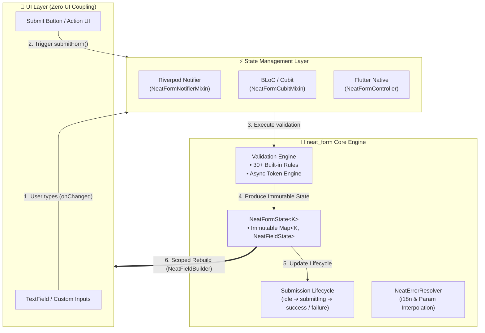

# neat_form 📋

A clean, lightweight, robust, and type-safe (100% `Object?`) form state management and validation library for **Flutter & Dart**.

[](https://pub.dev/packages/neat_form)
[](https://opensource.org/licenses/MIT)
[](https://github.com/datnguyennt/neat_form)
[](https://pub.dev)

> **[Tiếng Việt](README.md) | [English](README_EN.md)**

---

<a id="table-of-contents"></a>
## 📑 Table of Contents
- [1. 🇬🇧 Overview](#overview)
- [2. ✨ Key Features](#key-features)
- [3. 🏗️ Architecture & Data Flow](#architecture)
- [4. 📦 Installation](#installation)
- [5. 🚀 Quick Start Guide](#quick-start)
  - [Method 1: NeatForm UI Builders Suite (70% Less Boilerplate)](#method-1-ui-builders)
  - [Method 2: Flutter Native with `ListenableBuilder`](#method-2-native)
  - [Method 3: Seamless Riverpod Integration](#method-3-riverpod)
  - [Method 4: BLoC / Cubit Integration](#method-4-bloc)
- [6. ✈️ Dynamic Form Array (`NeatFormArray`)](#dynamic-array)
- [7. 🔄 Form Submission Lifecycle](#submission-lifecycle)
- [8. 📋 Built-in Validators (Cheat Sheet)](#validators-cheatsheet)
- [9. 🌐 Localization & Error Resolution](#localization)
- [10. 🎨 Input Formatters & Masking (`NeatInputFormatters`)](#input-formatters)
- [11. 📊 Event Tracking & Analytics (`NeatFormObserver`)](#form-observer)
- [12. ⚡ Race-Condition-Free Async Validation](#async-validation)
- [13. 📱 Showcase App](#showcase-app)
- [14. 📝 License](#license)

---

<a id="overview"></a>
## 1. 🇬🇧 Overview

**`neat_form`** is built around **Headless Architecture (Zero UI Coupling)**, **State-driven**, and **Immutable** design principles. It eliminates the boilerplate and complexity of form validation in Flutter, working out-of-the-box as a standalone solution or integrating seamlessly with any state manager (Riverpod, BLoC, Cubit, Signals, MobX, etc.).

### 🌐 Supported Platforms & Requirements
* **Platforms:** Android, iOS, Web, macOS, Windows, Linux (100% Flutter platforms).
* **SDK:** Flutter `>= 3.0.0`, Dart `>= 3.0.0 < 4.0.0`.
* **Zero Dependencies:** Zero external package dependencies (only Flutter SDK & `meta`), ensuring **100% freedom from dependency conflicts**.

---

<a id="key-features"></a>
## 2. ✨ Key Features

* 🚀 **Zero UI Coupling (Headless Form):** Complete separation of logic and presentation. Design any custom UI without framework constraints.
* 🧩 **UI Builders Suite (`NeatFormScope`, `NeatFieldBuilder`):** High-performance scoped widgets that only rebuild the specific field changed, cutting 70% of boilerplate.
* 🔒 **Type-Safe Generics (100% `Object?` - No `dynamic`):** Compile-time safety using Enum keys `K`.
* ✈️ **Dynamic Form Array:** Comprehensive support for dynamic list forms (add/remove/reorder guests, addresses, items) with `NeatFormArrayController`.
* ⏱️ **Race Condition Prevention:** Built-in sequence tokens automatically cancel stale async validation responses.
* 🌐 **Decoupled Localization:** Errors return `code` and `params` with automatic placeholder interpolation (`{minLength}`, `{maxValue}`).
* 🛠️ **30+ Built-in Validators & Formatters:** Extensive collection covering strings, numbers, dates, credit cards, hex colors, and JSON.

---

<a id="architecture"></a>
## 3. 🏗️ Architecture & Data Flow

`neat_form` cleanly divides concerns across 3 distinct layers: **UI Layer** ➔ **State Management Layer** ➔ **Core Logic Engine**.

<p align="center">
  
</p>

<details>
<summary>👁️ View Mermaid Diagram Source</summary>


</details>

---

<a id="installation"></a>
## 4. 📦 Installation

Add `neat_form` to your `pubspec.yaml`:

```yaml
dependencies:
  neat_form: ^1.2.7
```

Or run:
```bash
flutter pub add neat_form
```

---

<a id="quick-start"></a>
## 5. 🚀 Quick Start Guide

<a id="method-1-ui-builders"></a>
### Method 1: NeatForm UI Builders Suite (70% Less Boilerplate)

The UI Builders Suite provides scoped reactivity (only re-rendering the specific input being edited) and automatic controller resolution via `BuildContext`:

```dart
enum LoginFormKey { email, password }

class ModernLoginForm extends StatelessWidget {
  final _form = NeatFormController<LoginFormKey>.fromValues(
    initialValues: {LoginFormKey.email: '', LoginFormKey.password: ''},
    validators: {
      LoginFormKey.email: NeatValidators.email(),
      LoginFormKey.password: NeatValidators.minLength(6),
    },
  );

  @override
  Widget build(BuildContext context) {
    return NeatFormScope<LoginFormKey>(
      controller: _form,
      child: Column(
        children: [
          // 1. Auto-resolves controller from scope & ONLY rebuilds when email changes!
          NeatFieldBuilder<LoginFormKey, String>(
            field: LoginFormKey.email,
            builder: (context, fieldState, controller) => TextField(
              onChanged: (val) => controller.setField(LoginFormKey.email, val),
              decoration: InputDecoration(
                labelText: 'Email',
                errorText: fieldState.errorMessage,
              ),
            ),
          ),

          // 2. Password
          NeatFieldBuilder<LoginFormKey, String>(
            field: LoginFormKey.password,
            builder: (context, fieldState, controller) => TextField(
              obscureText: true,
              onChanged: (val) => controller.setField(LoginFormKey.password, val),
              decoration: InputDecoration(
                labelText: 'Password',
                errorText: fieldState.errorMessage,
              ),
            ),
          ),

          // 3. Submit button with automatic loading spinner & disable logic
          NeatSubmitButton<LoginFormKey>(
            onPressed: (controller) async {
              await controller.submitForm(
                onSubmit: (values) async => print('Login success: $values'),
              );
            },
            child: const Text('Login'),
          ),
        ],
      ),
    );
  }
}
```

---

<a id="method-2-native"></a>
### Method 2: Flutter Native with `ListenableBuilder`

For manual widget lifecycle management:

```dart
class NativeLoginFormState extends State<NativeLoginForm> {
  late final NeatFormController<LoginFormKey> _form;

  @override
  void initState() {
    super.initState();
    _form = NeatFormController<LoginFormKey>.fromValues(
      initialValues: {LoginFormKey.email: '', LoginFormKey.password: ''},
      validators: {
        LoginFormKey.email: NeatValidators.email(),
        LoginFormKey.password: NeatValidators.minLength(6),
      },
    );
  }

  @override
  void dispose() {
    _form.dispose();
    super.dispose();
  }

  @override
  Widget build(BuildContext context) {
    return ListenableBuilder(
      listenable: _form,
      builder: (context, _) {
        final email = _form.getField<String>(LoginFormKey.email);
        final password = _form.getField<String>(LoginFormKey.password);

        return Column(
          children: [
            TextField(
              onChanged: (val) => _form.setField(LoginFormKey.email, val),
              decoration: InputDecoration(labelText: 'Email', errorText: email.errorMessage),
            ),
            TextField(
              obscureText: true,
              onChanged: (val) => _form.setField(LoginFormKey.password, val),
              decoration: InputDecoration(labelText: 'Password', errorText: password.errorMessage),
            ),
            ElevatedButton(
              onPressed: _form.submissionStatus.isSubmitting
                  ? null
                  : () => _form.submitForm(onSubmit: (v) async => print('Values: $v')),
              child: _form.submissionStatus.isSubmitting
                  ? const CircularProgressIndicator()
                  : const Text('Login'),
            ),
          ],
        );
      },
    );
  }
}
```

---

<a id="method-3-riverpod"></a>
### Method 3: Seamless Riverpod Integration

Use `NeatFormNotifierMixin` within a Riverpod `Notifier`:

```dart
import 'package:flutter_riverpod/flutter_riverpod.dart';
import 'package:neat_form/neat_form.dart';

final loginProvider = NotifierProvider<LoginNotifier, NeatFormState<LoginFormKey>>(LoginNotifier.new);

class LoginNotifier extends Notifier<NeatFormState<LoginFormKey>> with NeatFormNotifierMixin<LoginFormKey> {
  @override
  NeatFormState<LoginFormKey> build() {
    return NeatFormState.fromValues({
      LoginFormKey.email: '',
      LoginFormKey.password: '',
    });
  }

  @override
  Map<LoginFormKey, NeatValidator<Object?>> get validators => {
        LoginFormKey.email: NeatValidators.email(),
        LoginFormKey.password: NeatValidators.minLength(6),
      };

  Future<void> submit() async {
    await submitForm(onSubmit: (values) async {
      print('Logged in: $values');
    });
  }
}
```

---

<a id="method-4-bloc"></a>
### Method 4: BLoC / Cubit Integration

Use `NeatFormCubitMixin`:

```dart
import 'package:flutter_bloc/flutter_bloc.dart';
import 'package:neat_form/neat_form.dart';

class LoginCubit extends Cubit<NeatFormState<LoginFormKey>> with NeatFormCubitMixin<LoginFormKey> {
  LoginCubit()
      : super(NeatFormState.fromValues({
          LoginFormKey.email: '',
          LoginFormKey.password: '',
        }));

  @override
  Map<LoginFormKey, NeatValidator<Object?>> get validators => {
        LoginFormKey.email: NeatValidators.email(),
        LoginFormKey.password: NeatValidators.minLength(6),
      };

  Future<void> login() async {
    await submitForm(onSubmit: (values) async {
      print('BLoC login: $values');
    });
  }
}
```

---

<a id="dynamic-array"></a>
## 6. ✈️ Dynamic Form Array (`NeatFormArray`)

Effortlessly manage dynamic lists of sub-forms (e.g. guests, shipping addresses, order items) with isolated IDs and validation:

```dart
enum GuestField { fullName, dateOfBirth, passportNo }

final guestsController = NeatFormArrayController<GuestField>(
  initialItems: [
    {GuestField.fullName: 'John Doe', GuestField.dateOfBirth: '15/08/1995', GuestField.passportNo: 'B1234567'},
  ],
  itemValidators: {
    GuestField.fullName: NeatValidators.required(),
    GuestField.dateOfBirth: NeatValidators.dateString(format: 'DD/MM/YYYY', minAge: 18),
    GuestField.passportNo: NeatValidators.required(),
  },
  arrayValidators: [
    NeatArrayValidators.minItems(1, message: 'At least 1 guest is required'),
    NeatArrayValidators.uniqueBy(GuestField.passportNo, message: 'Passport numbers must be unique'),
  ],
);

// Convenient CRUD helpers:
guestsController.addItem();             // Add a new blank item
guestsController.removeItemAt(0);       // Remove item by index
guestsController.reorderItem(0, 2);     // Reorder item (perfect for ReorderableListView)
```

---

<a id="submission-lifecycle"></a>
## 7. 🔄 Form Submission Lifecycle

<p align="center">
  
</p>

`NeatSubmissionStatus` provides 4 discrete states:
* `idle`: Initial state or reset state.
* `submitting`: Async submission in progress (display loading spinner).
* `success`: Submission completed successfully.
* `failure`: Submission failed with errors.

---

<a id="validators-cheatsheet"></a>
## 8. 📋 Built-in Validators (Cheat Sheet)

| Category | Validator | Description |
| :--- | :--- | :--- |
| **Basic** | `required()` | Mandatory non-empty input (string, num, list, map) |
| | `custom(predicate)` | Custom boolean predicate validation |
| **Strings** | `minLength(min)`, `maxLength(max)` | String length boundary constraints |
| | `exactLength(len)` | Exact character count constraint |
| | `email()`, `url()`, `phone()` | Email address, valid URL, Phone number |
| | `alpha()`, `numeric()`, `alphanumeric()` | Alphabetic, numeric, or alphanumeric characters |
| | `noWhitespace()`, `noHtml()` | Rejects whitespace or HTML tags |
| **Numeric** | `minValue(min)`, `maxValue(max)` | Min/max numerical boundary (supports num & string) |
| | `valueRange(min, max)` / `between` | Value must fall within `[min, max]` |
| | `positive()`, `negative()` | Positive ($> 0$), negative ($< 0$) |
| | `nonNegative()`, `nonPositive()` | Non-negative ($\ge 0$), non-positive ($\le 0$) |
| | `integerOnly()` | Rejects floating point numbers |
| **Date, Time & Card** | `dateString(format, minAge, maxAge)` | Calendar date validation with leap year & age bounds |
| | `timeString(format)` | 24-hour time format (`HH:mm` or `HH:mm:ss`) |
| | `creditCardExpiry()` | Credit card expiration (`MM/YY` or `MM/YYYY`) |
| **Network & Formats** | `ipv4()`, `ipv6()`, `ipAddress()` | Valid IP addresses |
| | `uuid()` | UUID/GUID v4 strings |
| | `hexColor()` | Hex color strings `#RGB`, `#RRGGBB` |
| | `jsonString()` | Valid JSON syntax |
| **Collections** | `oneOf(allowed)`, `noneOf(forbidden)` | Value inclusion / exclusion checks |
| **Cross-Field** | `match(targetKey)` | Match another field value (e.g. Confirm Password) |
| | `when(condition, validator)` | Conditional validation |
| **Dynamic Array** | `minItems(min)`, `maxItems(max)` | Array item count constraints |
| | `uniqueBy(fieldKey)` | Enforce distinct values across list items |

---

<a id="localization"></a>
## 9. 🌐 Localization & Error Resolution

Easily translate error codes into localized strings with automatic parameter interpolation:

```dart
final errorResolver = NeatErrorResolver(
  customHandlers: {
    NeatValidators.codeMinLength: (error) => 'Minimum ${error.params['minLength']} characters required',
  },
  fallbackResolver: (error) => 'Invalid input',
);

print(errorResolver.resolve(fieldState.error!));
```

---

<a id="input-formatters"></a>
## 10. 🎨 Input Formatters & Masking (`NeatInputFormatters`)

Real-time input formatting as the user types:

```dart
// 1. Currency (USD / VND)
TextField(inputFormatters: [NeatInputFormatters.currency(symbol: '\$', decimalDigits: 2)])

// 2. Credit Card (automatic 4-digit chunking)
TextField(inputFormatters: [NeatInputFormatters.creditCard()])

// 3. String Masking
TextField(inputFormatters: [NeatInputFormatters.mask('####-####-####')])

// 4. Uppercase & No Spaces
TextField(inputFormatters: [NeatInputFormatters.uppercase(), NeatInputFormatters.noSpaces()])
```

---

<a id="form-observer"></a>
## 11. 📊 Event Tracking & Analytics (`NeatFormObserver`)

Monitor all form events for logging, analytics, or debugging:

```dart
class AppFormObserver<K> extends NeatFormObserver<K> {
  @override
  void onFieldChanged(K key, Object? value) => print('Field $key changed to $value');

  @override
  void onValidationError(K key, NeatValidationError error) => print('Error on $key: ${error.code}');
}
```

---

<a id="async-validation"></a>
## 12. ⚡ Race-Condition-Free Async Validation

Automatically cancels obsolete validation requests when the user continues typing:

```dart
await formController.validateFieldAsync(
  LoginFormKey.username,
  (username) async {
    final isTaken = await api.checkUsername(username);
    if (isTaken) return const NeatValidationError('username_taken', message: 'Username is already in use');
    return null;
  },
);
```

---

<a id="showcase-app"></a>
## 13. 📱 Showcase App

Explore the complete multi-tab showcase application in the [`example/`](example) directory:

```bash
cd example
flutter run -d chrome
```

---

<a id="license"></a>
## 14. 📝 License

Released under the **MIT License**. Free for personal and commercial projects.
