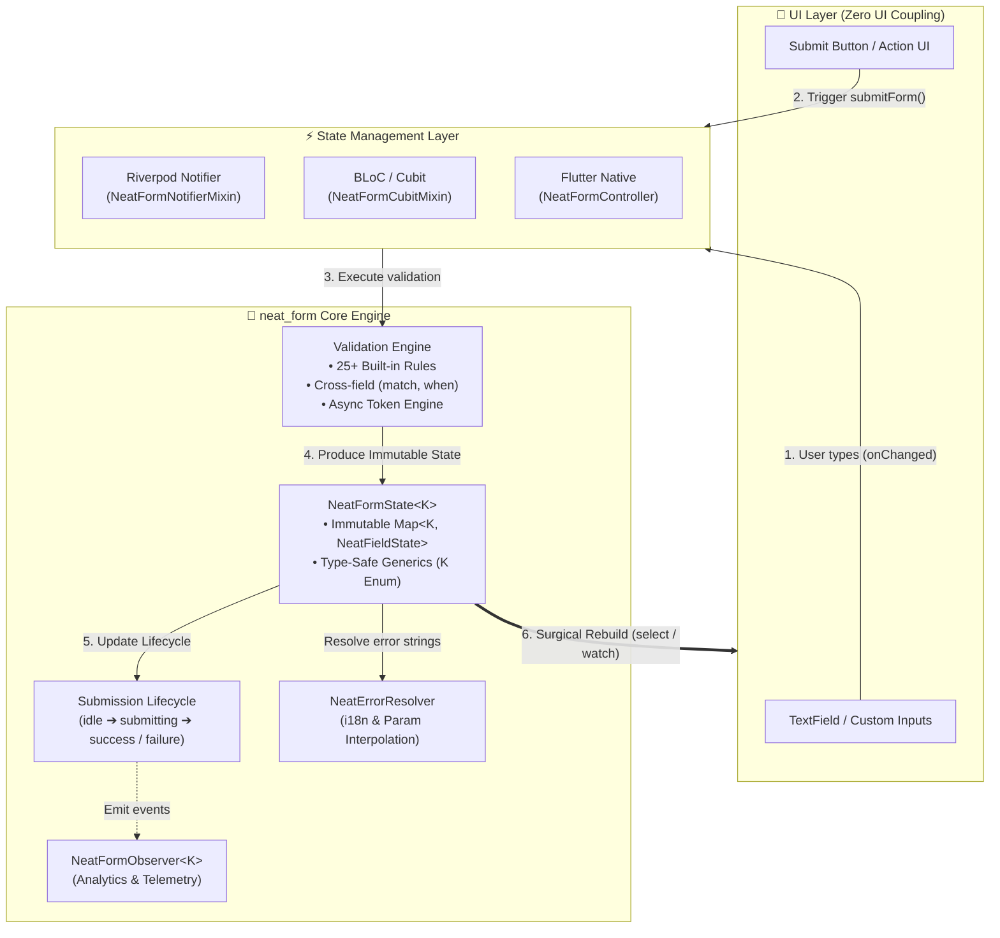
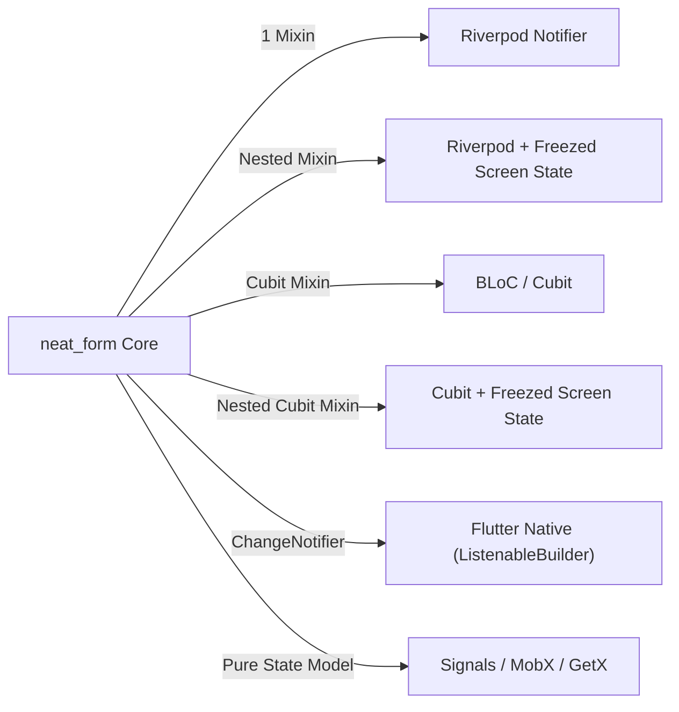
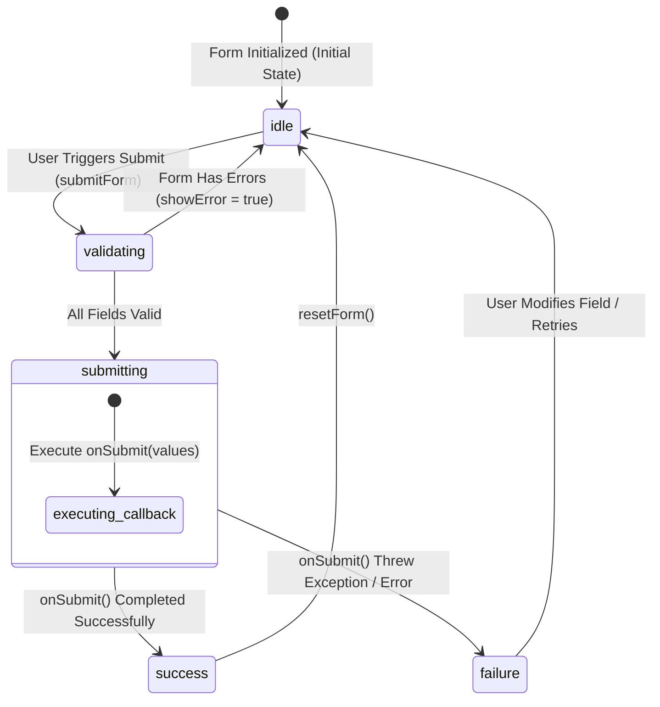
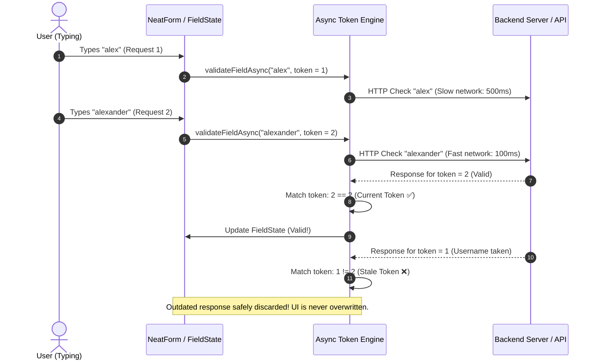

# neat_form 📋

A clean, lightweight, robust, and type-safe (100% `Object?`) form state management and validation library for **Flutter & Dart**.

[](https://pub.dev/packages/neat_form)
[](https://opensource.org/licenses/MIT)
[](https://github.com/datnguyennt/neat_form)
[](https://pub.dev)

> **[Tiếng Việt](README.md) | [English](README_EN.md)**

---

## 🇬🇧 Overview

**`neat_form`** is built around **Headless Architecture (Zero UI Coupling)**, **State-driven**, and **Immutable** design principles. It eliminates the boilerplate and complexity of form validation in Flutter, working out-of-the-box as a standalone solution or integrating seamlessly with any state manager (Riverpod, BLoC, Cubit, Signals, MobX, etc.).

---

### 🌐 Supported Platforms

`neat_form` runs flawlessly on all Flutter-supported platforms:

| Platform | Supported | Notes |
| :--- | :---: | :--- |
| **Android** | ✅ | All Android API versions |
| **iOS** | ✅ | All iOS versions |
| **Web** | ✅ | CanvasKit & HTML renderers |
| **macOS** | ✅ | Desktop App |
| **Windows** | ✅ | Desktop App |
| **Linux** | ✅ | Desktop App |

---

### ⚙️ System Requirements

- **Flutter SDK:** `>= 3.0.0`
- **Dart SDK:** `>= 3.0.0 < 4.0.0`
- **Zero Third-party Dependencies:** Only depends on Flutter SDK & `meta`. Guarantees **100% No Dependency Conflicts** with any existing project.

---

### ✨ Key Features

- 🚀 **Zero UI Coupling (Headless Form):** Pure logic layer — complete freedom to bind to any UI widgets (`TextField`, custom inputs, design systems).
- 🎯 **Native Flutter Integration:** `NeatFormController` extends `ChangeNotifier` / `Listenable` for direct reactive usage with `ListenableBuilder` or `AnimatedBuilder`.
- 🔒 **Strict Type Safety (100% `Object?` - No `dynamic`):** Full compile-time static type checks with `NeatFieldState<T>` and `NeatValidator<T>`.
- 🌐 **Decoupled Localization & Param Interpolation:** Validation errors produce machine-readable codes and params; `NeatErrorResolver` interpolates template placeholders like `{minLength}` and `{maxValue}`.
- ⏱️ **Race Condition Protection in Async Validations:** Token invalidation mechanism ensures slow in-flight async requests never overwrite newer user input.
- 🔄 **Form Submission Lifecycle:** Built-in 4-state lifecycle (`idle`, `submitting`, `success`, `failure`).
- 🛠️ **25+ Built-in Validators:** Strings, numbers, regex, Luhn algorithm credit card, dates, booleans, and collections.
- 🎨 **Built-in Input Formatters & Masking:** Real-time currency, credit card, custom masks, date formats, and casing utilities in pure Flutter SDK (0 external dependencies).

---

### 🏗️ Architecture & Workflow Diagrams

#### 1. Data Flow & Overall Architecture (Headless Pattern)

`neat_form` cleanly decouples your application into 3 layers: **UI Layer (Headless Widgets)** ➔ **State Management Layer (Mixins & Controllers)** ➔ **Core Logic Engine**.

<p align="center">
  
</p>

<details>
<summary>👁️ View Mermaid Source Diagram</summary>


</details>

#### 2. Multi-State Management Ecosystem Matrix

<p align="center">
  
</p>

<details>
<summary>👁️ View Mermaid Source Diagram</summary>


</details>

---

### 📦 Installation

Add `neat_form` to your `pubspec.yaml`:

```yaml
dependencies:
  neat_form: ^1.1.1
```

Or run:
```bash
flutter pub add neat_form
```

---

### 🚀 Quick Start

#### ⚡ Approach 1: First-Class Riverpod Integration (Notifier & Freezed)

##### A. Standalone Form State (Ultra-Clean Single Mixin)
Leverage `NeatFormNotifierMixin<K>` — **only 1 mixin required**, zero boilerplate methods:

```dart
import 'package:flutter/material.dart';
import 'package:flutter_riverpod/flutter_riverpod.dart';
import 'package:neat_form/neat_form.dart';

enum LoginFormKey { email, password }

// 1. Ultra-clean Notifier: Exactly 1 mixin, ZERO boilerplate!
class LoginNotifier extends Notifier<NeatFormState<LoginFormKey>>
    with NeatFormNotifierMixin<LoginFormKey> {
  @override
  NeatFormState<LoginFormKey> build() => NeatFormState.fromValues({
        LoginFormKey.email: '',
        LoginFormKey.password: '',
      });

  @override
  Map<LoginFormKey, NeatValidator<Object?>> get validators => {
        LoginFormKey.email: NeatValidators.combine([
          NeatValidators.required(message: 'Email is required'),
          NeatValidators.email(message: 'Invalid email address'),
        ]),
        LoginFormKey.password: NeatValidators.combine([
          NeatValidators.required(message: 'Password is required'),
          NeatValidators.minLength(8, message: 'Must be at least 8 characters'),
        ]),
      };
}

final loginNotifierProvider =
    NotifierProvider<LoginNotifier, NeatFormState<LoginFormKey>>(LoginNotifier.new);

// 2. UI with Surgical Rebuilding (Only the changed input rebuilds)
class EmailInput extends ConsumerWidget {
  const EmailInput({super.key});

  @override
  Widget build(BuildContext context, WidgetRef ref) {
    final email = ref.watch(
      loginNotifierProvider.select((s) => s.field<String>(LoginFormKey.email)),
    );

    return TextField(
      onChanged: (val) => ref.read(loginNotifierProvider.notifier).setField(LoginFormKey.email, val),
      decoration: InputDecoration(
        labelText: 'Email',
        errorText: email.errorMessage, // ✨ Directly binds error message if visible
      ),
    );
  }
}
```

##### B. Nested / Freezed Screen State (When Form is part of Screen State)
If your screen uses a **Freezed** data class (`LoginScreenState` containing the form plus other screen properties), use `NeatNestedFormNotifierMixin<S, K>`:

```dart
// 1. Define Freezed Screen State
@freezed
class LoginScreenState with _$LoginScreenState {
  const factory LoginScreenState({
    @Default(false) bool isSubmitting,
    @Default(false) bool rememberMe,
    String? serverError,
    required NeatFormState<LoginFormKey> form,
  }) = _LoginScreenState;
}

// 2. Notifier managing nested form state seamlessly
class LoginScreenNotifier extends Notifier<LoginScreenState>
    with NeatNestedFormNotifierMixin<LoginScreenState, LoginFormKey> {
  @override
  LoginScreenState build() => LoginScreenState(
        form: NeatFormState.fromValues({
          LoginFormKey.email: '',
          LoginFormKey.password: '',
        }),
      );

  @override
  NeatFormState<LoginFormKey> getForm(LoginScreenState state) => state.form;

  @override
  LoginScreenState updateForm(LoginScreenState state, NeatFormState<LoginFormKey> form) =>
      state.copyWith(form: form);

  @override
  Map<LoginFormKey, NeatValidator<Object?>> get validators => { ... };
}
```

---

#### ⚡ Approach 2: BLoC / Cubit (Standalone & Freezed Support)

##### A. Standalone Cubit Form (Auto-wires `emit()`)
Use `NeatFormCubitMixin<K>` — no manual state mapping or boilerplate methods:

```dart
import 'package:flutter_bloc/flutter_bloc.dart';
import 'package:neat_form/neat_form.dart';

enum ProfileKey { name, age }

class ProfileCubit extends Cubit<NeatFormState<ProfileKey>>
    with NeatFormCubitMixin<ProfileKey> {
  ProfileCubit()
      : super(
          NeatFormState.fromValues({
            ProfileKey.name: '',
            ProfileKey.age: null,
          }),
        );

  @override
  Map<ProfileKey, NeatValidator<Object?>> get validators => {
        ProfileKey.name: NeatValidators.required(message: 'Name is required'),
        ProfileKey.age: NeatValidators.combine([
          NeatValidators.required(),
          NeatValidators.minValue(18, message: 'Must be 18+'),
        ]),
      };

  void onNameChanged(String val) => setAndValidateField(ProfileKey.name, val);
  void onAgeChanged(int? val) => setAndValidateField(ProfileKey.age, val);
}
```

##### B. Cubit with Freezed Screen State
Use `NeatNestedFormCubitMixin<S, K>` when Cubit manages a Freezed parent state:

```dart
class ProfileCubit extends Cubit<ProfileScreenState>
    with NeatNestedFormCubitMixin<ProfileScreenState, ProfileKey> {
  ProfileCubit() : super(ProfileScreenState(form: NeatFormState.fromValues({ ... })));

  @override
  NeatFormState<ProfileKey> getForm(ProfileScreenState state) => state.form;

  @override
  ProfileScreenState updateForm(ProfileScreenState state, NeatFormState<ProfileKey> form) =>
      state.copyWith(form: form);

  @override
  Map<ProfileKey, NeatValidator<Object?>> get validators => { ... };
}
```

---

#### ⚡ Approach 3: Flutter Native with `ListenableBuilder` (No external state manager)

```dart
import 'package:flutter/material.dart';
import 'package:neat_form/neat_form.dart';

enum LoginFormKey { email, password }

class LoginFormPage extends StatefulWidget {
  const LoginFormPage({super.key});

  @override
  State<LoginFormPage> createState() => _LoginFormPageState();
}

class _LoginFormPageState extends State<LoginFormPage> {
  late final NeatFormController<LoginFormKey> _form;

  @override
  void initState() {
    super.initState();
    _form = NeatFormController<LoginFormKey>(
      initialFields: {
        LoginFormKey.email: const NeatFieldState<String>(value: ''),
        LoginFormKey.password: const NeatFieldState<String>(value: ''),
      },
      validators: {
        LoginFormKey.email: NeatValidators.combine([
          NeatValidators.required(message: 'Email is required'),
          NeatValidators.email(message: 'Invalid email format'),
        ]),
        LoginFormKey.password: NeatValidators.combine([
          NeatValidators.required(message: 'Password is required'),
          NeatValidators.minLength(8, message: 'Must be at least {minLength} characters'),
          NeatValidators.passwordStrength(message: 'Must include uppercase, lowercase, digit & symbol'),
        ]),
      },
    );
  }

  @override
  void dispose() {
    _form.dispose();
    super.dispose();
  }

  @override
  Widget build(BuildContext context) {
    return ListenableBuilder(
      listenable: _form,
      builder: (context, _) {
        final emailField = _form.getField<String>(LoginFormKey.email);
        final passwordField = _form.getField<String>(LoginFormKey.password);

        return Column(
          children: [
            TextField(
              onChanged: (val) => _form.setField(LoginFormKey.email, val),
              decoration: InputDecoration(
                labelText: 'Email',
                errorText: emailField.errorMessage,
              ),
            ),
            TextField(
              obscureText: true,
              onChanged: (val) => _form.setField(LoginFormKey.password, val),
              decoration: InputDecoration(
                labelText: 'Password',
                errorText: passwordField.errorMessage,
              ),
            ),
            ElevatedButton(
              onPressed: _form.submissionStatus.isSubmitting
                  ? null
                  : () async {
                      await _form.submitForm(
                        onSubmit: (values) async {
                          print('Valid form values: $values');
                        },
                      );
                    },
              child: _form.submissionStatus.isSubmitting
                  ? const CircularProgressIndicator()
                  : const Text('Login'),
            ),
          ],
        );
      },
    );
  }
}
```

---

### 🔄 Form Submission Lifecycle

`neat_form` features a built-in 4-state state machine via `NeatSubmissionStatus`:

<p align="center">
  
</p>

<details>
<summary>👁️ View Mermaid Source Diagram</summary>


</details>

---

### 📋 Built-in Validators Cheat Sheet

| Category | Validator | Description |
| :--- | :--- | :--- |
| **Required & Strings** | `required()` | Field must not be null or empty |
| | `notBlank()` | String must not be purely whitespace |
| | `exactLength(n)` | String must have exact length of $n$ chars |
| | `minLength(n)` | Minimum string length |
| | `maxLength(n)` | Maximum string length |
| | `lengthRange(min, max)` | Length within range $[min, max]$ |
| | `startsWith(prefix)` | String starts with specified prefix |
| | `endsWith(suffix)` | String ends with specified suffix |
| | `contains(sub)` / `notContains(sub)` | Substring inclusion / exclusion |
| | `latinOnly()` | Unaccented Latin characters and spaces only |
| | `noEmoji()` | Disallows Emoji characters |
| **Format & Security** | `email()` | Standard international email format |
| | `phone()` | Phone number (8-15 digits, optional `+`) |
| | `passwordStrength()` | Enforces uppercase, lowercase, digits, symbols |
| | `creditCard()` | Credit card validation using Luhn Algorithm |
| | `url()` | HTTP/HTTPS web address format |
| | `numeric()` | Integer or decimal string |
| | `alphanumericOnly()` | Letters and digits only |
| | `noSpecialChars()` | No special symbol characters |
| | `noSpaces()` / `noLeadingTrailingSpaces()` | No spaces / no outer whitespace |
| | `blacklist(words)` | Disallows forbidden keywords |
| | `noHtml()` | Disallows HTML / script tags (anti-XSS) |
| **Numeric** | `minValue(n)` / `maxValue(n)` | Minimum / maximum numeric value |
| | `positive()` / `negative()` | Strictly positive ($>0$) or negative ($<0$) |
| | `multipleOf(step)` | Number must be divisible by step |
| | `decimalPrecision(maxDec)` | Maximum decimal places allowed |
| **DateTime** | `pastDate()` | Date must be in the past |
| | `futureDate()` | Date must be in the future |
| | `dateRange(min, max)` | Date within range $[min, max]$ |
| **Consent & Booleans**| `mustBeTrue()` | Must be true (e.g. Terms acceptance) |
| | `mustBeFalse()` | Must be false |
| **Collections** | `minItems(n)` / `maxItems(n)` | Minimum / maximum number of items |
| | `uniqueItems()` | Disallows duplicate items in list |
| **Logic & Combinators** | `match(targetGetter)` | Matches another field value (confirm password) |
| | `when(condition, validator)` | Conditional validation rule (`requiredIf`) |
| | `combine([v1, v2, ...])` | Combines multiple validators into one |
| | `custom(predicate)` | Creates quick custom predicate validator |

---

### 🌐 Localization & Error Resolver

`neat_form` decouples UI presentation from validation logic:

```dart
final resolver = NeatErrorResolver<BuildContext>();

// Register handler
resolver.register(
  NeatValidators.codeMinLength,
  (context, params, fieldName) {
    return '$fieldName must be at least ${params["minLength"]} characters';
  },
);

// Resolve in UI
final errorText = resolver.resolve(context, fieldState.error!, fieldName: 'Password');
```

---

### 🎨 Built-in Input Formatters & Masking (`NeatInputFormatters`)

`neat_form` provides a comprehensive suite of pure Flutter `TextInputFormatter` utilities (0 external dependencies) with accurate cursor preservation:

#### 1. Real-Time Currency Formatter (`currency`)
```dart
final currencyFormatter = NeatInputFormatters.currency(
  thousandSeparator: ',',
  decimalSeparator: '.',
  prefix: r'$',
  allowDecimals: true,
);

TextField(
  keyboardType: TextInputType.number,
  inputFormatters: [currencyFormatter],
  onChanged: (val) {
    // Extract raw numeric value (num / double / int) for form state
    final amount = currencyFormatter.getNumericValue(val);
    form.setField(PaymentKey.amount, amount);
  },
);
```

#### 2. Payment Card Formatter (`creditCard`)
Auto-detects card brand (Visa, Mastercard, Amex, JCB, Discover) and applies 4-4-4-4 or 4-6-5 grouping:
```dart
TextField(
  keyboardType: TextInputType.number,
  inputFormatters: [NeatInputFormatters.creditCard()],
  onChanged: (val) => form.setField(
    PaymentKey.cardNumber,
    NeatCardFormatter.getCleanCardNumber(val), // '4111222233334444'
  ),
);
```

#### 3. Custom Mask Formatter (`mask`)
```dart
final phoneFormatter = NeatInputFormatters.mask('(###) ###-####');

TextField(
  keyboardType: TextInputType.phone,
  inputFormatters: [phoneFormatter],
  onChanged: (val) => form.setField(
    RegisterKey.phone,
    phoneFormatter.getUnmaskedText(val), // '0901234567'
  ),
);
```

#### 4. Date Formatter (`date`)
```dart
TextField(
  keyboardType: TextInputType.number,
  inputFormatters: [
    NeatInputFormatters.date(format: NeatDateFormat.ddMMyyyy),
  ],
);
```

#### 5. Utility Text Formatters
- `NeatInputFormatters.uppercase()`: Auto-capitalizes input (promo codes, license plates).
- `NeatInputFormatters.lowercase()`: Auto-lowercases input (usernames, email handles).
- `NeatInputFormatters.latinOnly()`: Permits only ASCII/latin characters `[a-zA-Z0-9_]`.
- `NeatInputFormatters.noSpaces()`: Denies all whitespace characters.

---

### 📊 Event Monitoring & Telemetry (Form Observer)

`neat_form` provides `NeatFormObserver<K>` to track the entire form lifecycle, field updates, validation errors, and submission status — ideal for telemetry, analytics, and debugging:

```dart
class AppFormObserver extends NeatFormObserver<LoginFormKey> {
  @override
  void onFieldChanged(LoginFormKey key, Object? value) {
    debugPrint('Field [${key.name}] changed to: $value');
  }

  @override
  void onValidationError(LoginFormKey key, NeatValidationError error) {
    debugPrint('Validation error on [${key.name}]: ${error.code}');
  }

  @override
  void onSubmissionStatusChanged(NeatSubmissionStatus status) {
    debugPrint('Form submission status: ${status.name}');
  }

  @override
  void onFormSubmitted(Map<LoginFormKey, Object?> values, {required bool isValid}) {
    debugPrint('Form submitted: isValid=$isValid, values=$values');
  }
}
```

---

### ⚡ Async Validation with Race-Condition Protection

Use `validateFieldAsync` with automatic sequence token invalidation so out-of-order network responses never corrupt newer user input:

<p align="center">
  
</p>

<details>
<summary>👁️ View Mermaid Source Diagram</summary>


</details>

```dart
await form.validateFieldAsync<String>(
  SignupFormKey.username,
  (username) async {
    final isTaken = await api.checkUsernameTaken(username);
    if (isTaken) {
      return const NeatValidationError(
        'username_taken',
        message: 'Username is already taken',
      );
    }
    return null;
  },
);
```

---

### ⚠️ Limitations & FAQ

#### 1. Does neat_form provide pre-built UI widgets like `NeatTextField`?
> **No.** `neat_form` follows the **Headless Form** philosophy. It manages state and logic, giving you 100% freedom to use standard `TextField`, `TextFormField`, or your team's custom UI design system.

#### 2. How do I validate a Multi-step / Wizard Form?
> Simply pass the subset of keys for the active step:
> ```dart
> final isStep1Valid = form.validateForm([StepKey.email, StepKey.phone]);
> ```

#### 3. How does async validation handle fast typing?
> `neat_form` includes built-in **Race Condition Tokens** so that obsolete in-flight requests are automatically discarded. Combine it with a simple `Timer` debounce as demonstrated in `example/lib/main.dart`.

---

### 📱 Flutter Showcase App

A complete multi-platform demo application is available inside the `example/` directory.

Run the example app:
```bash
cd example
flutter run -d chrome # or -d ios, -d android, -d macos
```

---

## 📝 License

Released under the [MIT License](LICENSE).
